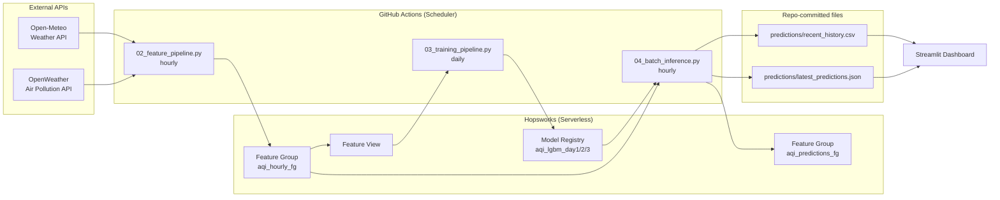
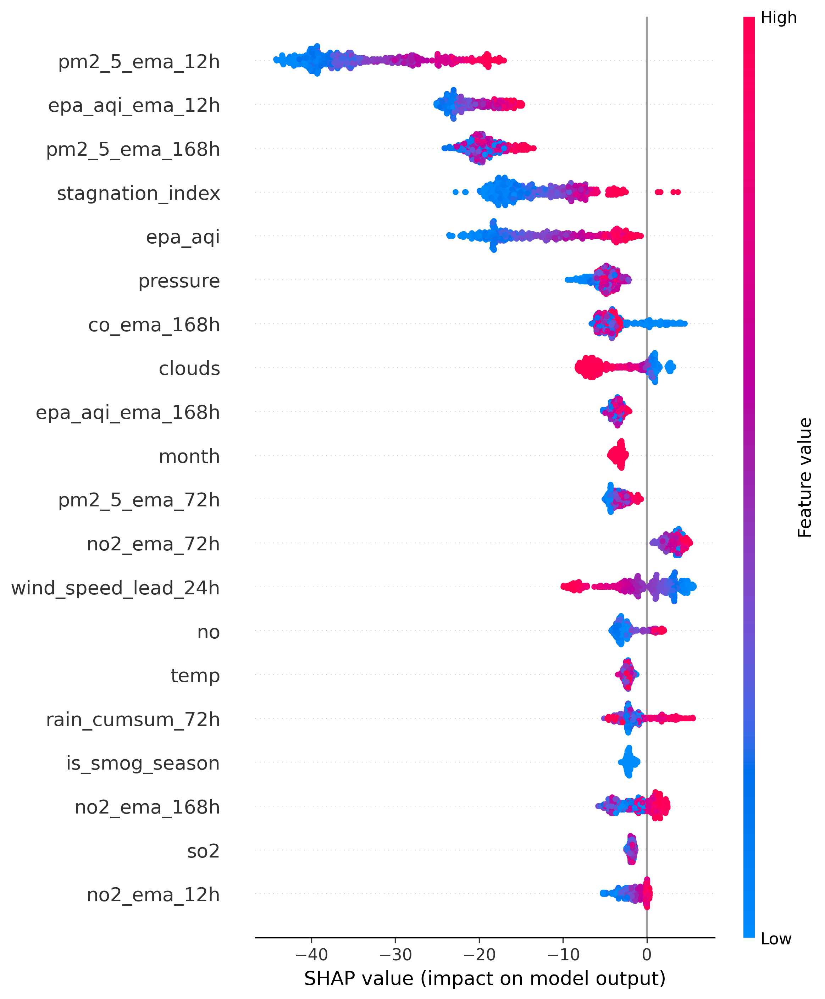
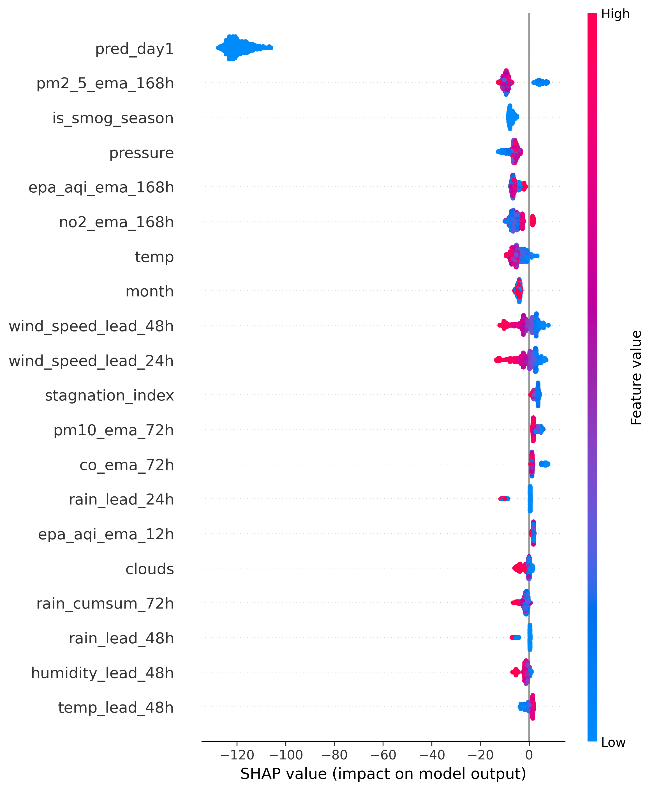
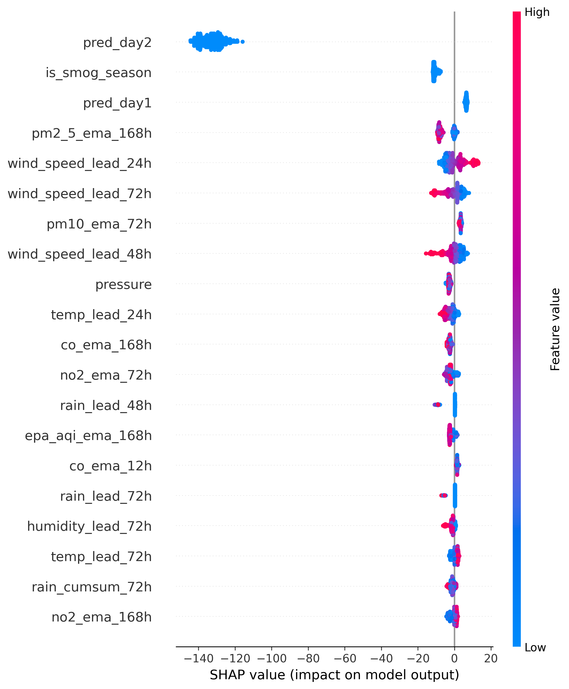

# 🌤️ Pearls AQI Predictor - Lahore

[](https://www.python.org/)
[](https://lightgbm.readthedocs.io/)
[](https://www.hopsworks.ai/)
[](https://streamlit.io/)
[](https://shap.readthedocs.io/)
[](#)

[](https://github.com/talha-64/AQI_Predictor/actions/workflows/hourly_feature_pipeline.yml)
[](https://github.com/talha-64/AQI_Predictor/actions/workflows/daily_training_pipeline.yml)

An end-to-end, 100% serverless machine learning system that forecasts the Air Quality Index (AQI) for Lahore, Pakistan, 3 days in advance - hourly data collection, feature engineering, model training, and live predictions, fully automated with no servers to manage.

**Data Science Internship Project** · [Muhammad Talha](https://github.com/talha-64) · [Repository](https://github.com/talha-64/AQI_Predictor)

---

## Overview

Lahore regularly experiences some of the worst air quality in the world, especially during the Oct–Feb smog season. This project builds a production ML pipeline that:

1. Pulls live pollutant and weather data every hour
2. Engineers a rich feature set (EMAs, lags, volatility, seasonal signals) validated through extensive EDA
3. Trains three chained LightGBM models - one per forecast horizon (24h / 48h / 72h) - blended with a persistence baseline
4. Serves predictions through a live Streamlit dashboard, with hazardous-AQI alerting

Everything runs on free-tier serverless infrastructure: [Hopsworks](https://www.hopsworks.ai/) as the feature store + model registry, GitHub Actions + [Cron-Job](https://cron-job.org/en/) as the scheduler/CI, and Streamlit for the frontend.

---

## Architecture



`01_backfill.py` (run once, manually) seeds `aqi_hourly_fg` with ~5 years of history before the hourly/daily automation takes over.

---

## Key Features

- **Hourly feature pipeline** - fetches live pollution + weather, engineers the full feature set, writes to the Hopsworks Feature Store
- **Daily retraining pipeline** - retrains all 3 horizon models on the full historical feature set, evaluates against a persistence baseline, registers new model versions
- **Chained multi-horizon forecasting** - the Day 2 model sees the Day 1 prediction as an input feature, Day 3 sees both, capturing cross-horizon structure
- **Persistence-blended predictions** - each model's output is blended with simple persistence (today's AQI carried forward), since Lahore's AQI is highly autocorrelated and a raw model alone doesn't reliably beat that baseline at longer horizons
- **SHAP explainability** - feature importance plots generated per horizon on every training run
- **Hazardous AQI alerting** - dashboard flags forecasts at/above the "Unhealthy" threshold
- **Fully automated CI/CD** - GitHub Actions runs the feature pipeline hourly and retraining daily, no manual intervention required
- **Interactive dashboard** - current AQI, 3-day forecast cards, 14-day trend, health guidance, model explainability tab

---

## Project Structure

```
AQI_PREDICTOR/
├── .github/workflows/
│   ├── hourly_feature_pipeline.yml     # runs 02 + 04 every hour
│   └── daily_training_pipeline.yml     # runs 03 daily at 02:30 UTC
├── dashboard/
│   └── app.py                          # Streamlit dashboard
├── models/                             # local safety-net model copies
├── notebooks/
│   ├── data/lahore_pollution_weather_5yr.csv
│   ├── SHAP/                           # per-horizon SHAP summary plots
│   ├── EDA.ipynb                       # exploratory data analysis
├── pipelines/
│   ├── 01_backfill.py                  # one-time historical backfill
│   ├── 02_feature_pipeline.py          # hourly: fetch + engineer + store
│   ├── 03_training_pipeline.py         # daily: train + evaluate + register
│   └── 04_batch_inference.py           # hourly: predict + alert + publish
├── predictions/
│   ├── latest_predictions.json         # current forecast snapshot
│   └── recent_history.csv              # rolling 14-day AQI trend
├── src/
│   ├── config.py                       # constants, paths, feature/model config
│   ├── data_fetcher.py                 # OpenWeather + Open-Meteo API clients
│   ├── feature_engineering.py          # feature build + pruning logic
│   ├── model_trainer.py                # chained model training + registry I/O
│   └── utils.py                        # EPA AQI calc, parsing helpers
├── .env                                # local secrets (not committed)
├── requirements.txt
└── README.md
```

---

## Tech Stack

| Layer                          | Technology                                                     |
| ------------------------------ | -------------------------------------------------------------- |
| Language                       | Python 3.11                                                    |
| Modeling                       | LightGBM (chained multi-horizon), scikit-learn, SHAP           |
| Feature Store & Model Registry | [Hopsworks](https://www.hopsworks.ai/) (Serverless, free tier) |
| Data Sources                   | OpenWeather Air Pollution API, Open-Meteo Weather API          |
| CI-CD                          | GitHub Actions + Cron-Job                                      |
| Dashboard                      | Streamlit + Plotly                                             |
| Explainability                 | SHAP                                                           |

---

## How It Works

### 1. Feature Engineering

Built from an extensive EDA (`notebooks/EDA.ipynb`) that found:

- **Strong smog-season effect** (Oct–Feb averages ~2x the rest of the year) → `is_smog_season` flag
- **High autocorrelation** (AQI 72h out still correlates at r ≈ 0.65 with the current reading) → this is why persistence is blended into every prediction, not just used as a benchmark
- **Wind is the dominant dispersal mechanism** → `stagnation_index = pm2_5 / (wind_speed + 0.5)`
- **Rain clears pollution** → `rain_cumsum_72h`

Full engineered set (`src/feature_engineering.py`, `src/config.py`):

- EMAs at 12h / 72h / 168h spans on PM2.5, PM10, EPA AQI, CO, NO₂
- Autoregressive lags at 24h / 48h / 72h / 168h on EPA AQI
- Rolling volatility (`aqi_std_24h`, `aqi_std_72h`)
- Cyclical time encoding (`hour_sin`/`cos`)
- Forward-shifted weather features for 24h/48h/72h lead context (real forecast values at inference time, shifted historical values during training)

**Feature pruning** (validated via ablation + correlation analysis): calendar day-of-year features were dropped after testing showed they acted as a "which season does this look like" shortcut rather than real AQI dynamics; redundant AQI-family columns (correlation 0.79–0.98 with each other) were trimmed down to one current value, one short EMA, one long EMA, and one volatility measure.

### 2. Model

Three LightGBM regressors, chained across horizons:

```
Day 1 model:  features → prediction
Day 2 model:  features + Day 1 prediction → prediction
Day 3 model:  features + Day 1 + Day 2 predictions → prediction
```

Each model's raw output is blended with persistence:

```
final_prediction = 0.4 × model_prediction + 0.6 × current_AQI
```

### 3. Latest Model Performance

| Horizon     | Model Weight | MAE   | RMSE  | R²        |
| ----------- | ------------ | ----- | ----- | --------- |
| Day 1 (24h) | 0.4          | 20.05 | 28.46 | **0.883** |
| Day 2 (48h) | 0.4          | 31.93 | 44.79 | **0.713** |
| Day 3 (72h) | 0.4          | 35.80 | 49.25 | **0.656** |

_(From the most recent `03_training_pipeline.py` run - updates daily as the model retrains on fresh data.)_

### 4. Explainability (SHAP)

Regenerated automatically every day by `03_training_pipeline.py`, showing which features drove each horizon's predictions on the most recent training run.

<table>
<tr>
<td align="center"><b>Day 1 (24h)</b><br/></td>
<td align="center"><b>Day 2 (48h)</b><br/></td>
<td align="center"><b>Day 3 (72h)</b><br/></td>
</tr>
</table>

---

## Setup & Installation

### Prerequisites

- Python 3.11
- A free [Hopsworks](https://www.hopsworks.ai/) account + project
- A free [OpenWeather](https://openweathermap.org/api) API key

### 1. Clone & install

```bash
git clone https://github.com/talha-64/AQI_Predictor.git
cd AQI_Predictor
python -m venv .venv
source .venv/bin/activate   # .venv\Scripts\activate on Windows
pip install -r requirements.txt
```

### 2. Configure environment

Create a `.env` file in the project root:

```dotenv
OPENWEATHER_API_KEY=
HOPSWORKS_API_KEY=
HOPSWORKS_API_URL=
HOPSWORKS_PROJECT_NAME=
CITY_LATITUDE=31.480961
CITY_LONGITUDE=74.363350
LOCATION_NAME=Lahore
```

> The current pipeline uses **OpenWeather** for pollution data and **Open-Meteo** for weather (no key required for Open-Meteo).

### 3. Run the pipeline (first time, in order)

```bash
# One-time: backfill ~5 years of historical data into the Feature Store
python pipelines/01_backfill.py --days 1900

# Train the initial models and register them
python pipelines/03_training_pipeline.py

# Fetch the current hour's data
python pipelines/02_feature_pipeline.py

# Generate the 3-day forecast
python pipelines/04_batch_inference.py
```

### 4. Launch the dashboard

```bash
streamlit run dashboard/app.py
```

---

## Automation

Two GitHub Actions workflows handle everything after the initial setup:

| Workflow | Schedule | What it does |
|---|---|---|
| `hourly_feature_pipeline.yml` | Every hour (`17 * * * *`) | Fetches latest data → engineers features → stores in Hopsworks → generates forecast → commits `predictions/*` back to the repo |
| `daily_training_pipeline.yml` | Daily at 02:30 UTC | Retrains all 3 models on the full feature history → registers new versions in the Model Registry |

**Required repo secrets** (Settings → Secrets and variables → Actions):
- `OPENWEATHER_API_KEY`
- `HOPSWORKS_API_KEY`
- `HOPSWORKS_PROJECT_NAME`

`04_batch_inference.py` always loads the **latest registered model version** for each horizon automatically — no manual version bumping needed after a retrain.

### Trigger reliability — [cron-job.org](https://cron-job.org)

GitHub's native `schedule:` trigger is documented as "best effort" and can silently skip runs under load, particularly around commonly-used minute offsets. To keep the hourly pipeline firing reliably, this project also uses **[cron-job.org](https://cron-job.org)** as an external scheduler: it calls GitHub's REST API on a fixed hourly interval to dispatch a `workflow_dispatch` event against `hourly_feature_pipeline.yml`, independent of GitHub's own cron scheduler.

---

## Dashboard

The Streamlit dashboard (`dashboard/app.py`) displays:

- Current AQI + 3-day forecast cards, color-coded by EPA category
- Health advisory banner based on current conditions
- 14-day AQI trend chart (Plotly, PKT-localized)
- Horizon breakdown and model explainability tabs
- Hazardous-level alerts when any forecasted day crosses the "Unhealthy" threshold

It reads exclusively from two small local files (`predictions/latest_predictions.json`, `predictions/recent_history.csv`) rather than querying Hopsworks live - this keeps the dashboard fast and avoids load on the free-tier feature store regardless of how many people have it open.

---

## Known Issues / Engineering Notes

A few non-obvious things worth knowing if you extend this project:

- **Hopsworks' offline Arrow Flight/DuckDB query service has had intermittent server-side reliability issues** (materialization job failures, a "release unlocked lock" crash). All pipeline reads use the **online store first**, with a Hive/Spark fallback, rather than the default offline path - see `fetch_recent_features()` / `read_full_feature_history()`.
- **Feature Group schema is strict on dtypes** - it was inferred as 32-bit `float` at backfill time, so every insert explicitly casts to `float32` (except `timestamp_unix`, which must stay `int64`).
- **GitHub's `schedule` trigger is best-effort** and can silently skip runs, especially after a workflow has been manually disabled/re-enabled. If scheduled runs stop firing, push a fresh commit to the workflow file to force re-registration. If it still doesn't works, Cron-Job is the best free alternative to look for.

---

## Acknowledgments

Built as part of a Data Science internship project. Tech stack and requirements per the assigned project brief (serverless AQI prediction using Hopsworks, GitHub Actions, Streamlit, SHAP).
